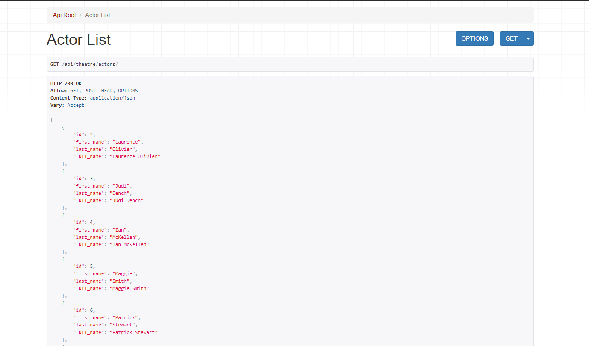

# Theatre Management API

The Theatre Management API is a Django-based web application designed to facilitate the management of plays, performances, reservations, and related data for a theatre. This API provides various endpoints for administrators and authenticated users to interact with the system. It includes features such as viewing and filtering plays, managing performances, creating reservations, and more.

## Getting Started

### Prerequisites

Before you begin, make sure you have the following tools and technologies installed:

- Python (>=3.6)
- Django
- Django REST framework

## Installing / Getting started
> A quick introduction of the setup you need to get run a project.

### Using Git
1. Clone the repo:
```shell
git clone https://github.com/Andriy-Sydorenko/theatre-api-service
```
2. You can open project in IDE and configure .env file using [.env.sample](.env.sample) file as an example.
<details>
<summary>Parameters for .env file:</summary>

- **DJANGO_DEBUG**: `Set True if you want debug menu to be on, and False for debug menu to be off`
- **DJANGO_SECRET_KEY**: `Your django secret key, you can generate one on https://djecrety.ir`
- **POSTGRES_DB**: `Name of your DB`
- **POSTGRES_DB_PORT**: `Port of your DB`
- **POSTGRES_USER**: `Name of your user for DB`
- **POSTGRES_PASSWORD**: `Your password in DB`
- **POSTGRES_HOST** `Host of your DB`
</details>

3. Run docker-compose command to build and run containers:
```shell
docker-compose up --build
```
### Using Docker Hub
1. Login into the Docker:
```shell
docker login
```

2. Pull the project:
```shell
docker pull andriysydorenko/theatre_api_service:latest
```

3. Run the containers:
```shell
docker-compose up
```


> To access browsable api, use http://localhost:8000/api/theatre/
> 
> To get access to the content, visit http://localhost:8000/api/user/token/ to get JWT token.
> 
> Use the following admin user:
> - Email: admin1@test.com
> - Password: defi4637

## API Endpoints

<details>
  <summary>Actors</summary>
  
- **List Actors**: `GET /api/theatre/actors/`
- **Create Actor**: `POST /api/theatre/actors/`
- **Retrieve Actor**: `GET /api/theatre/actors/{actor_id}/`
- **Update Actor**: `PUT /api/theatre/actors/{actor_id}/`
- **Partial Update** `PATCH /api/theatre/actors/{actor_id}/`
- **Delete Actor**: `DELETE /api/theatre/actors/{actor_id}/`
</details>

<details>
  <summary>Genres</summary>
  
- **List Genres**: `GET /api/theatre/genres/`
- **Create Genre**: `POST /api/theatre/genres/`
- **Retrieve Genre**: `GET /api/theatre/genres/{genre_id}/`
- **Update Genre**: `PUT /api/theatre/genres/{genre_id}/`
- **Partial Update**: `PATCH /api/theatre/genres/{genre_id}/`
- **Delete Genre**: `DELETE /api/theatre/genres/{genre_id}/`
</details>

<details>
  <summary>Performances</summary>
  
- **List Performances**: `GET /api/theatre/performances/`
- **Create Performance**: `POST /api/theatre/performances/`
- **Retrieve Performance**: `GET /api/theatre/performances/{performance_id}/`
- **Update Performance**: `PUT /api/theatre/performances/{performance_id}/`
- **Partial Update** `PATCH /api/theatre/performances/{performance_id}/`
- **Delete Performance**: `DELETE /api/theatre/performances/{performance_id}/`
</details>

<details>
  <summary>Plays</summary>
  
- **List Plays**: `GET /api/theatre/plays/`
- **Create Play**: `POST /api/theatre/plays/`
- **Retrieve Play**: `GET /api/theatre/plays/{play_id}/`
- **Update Play**: `PUT /api/theatre/plays/{play_id}/`
- **Partial Update** `PATCH /api/theatre/plays/{play_id}/`
- **Delete Play**: `DELETE /api/theatre/plays/{play_id}/`
- **Image Upload**: `POST /api/theatre/plays/{play_id}/upload-image/`
</details>

<details>
  <summary>Reservations</summary>
  
- **List Reservations**: `GET /api/theatre/reservations/`
- **Create Reservation**: `POST /api/theatre/reservations/`
- **Retrieve Reservation**: `GET /api/theatre/reservations/{reservation_id}/`
- **Update Reservation**: `PUT /api/theatre/reservations/{reservation_id}/`
- **Partial Update** `PATCH /api/theatre/reservations/{reservation_id}/`
- **Delete Reservation**: `DELETE /api/theatre/reservations/{reservation_id}/`
</details>

<details>
  <summary>Theatre Halls</summary>
  
- **List Theatre Halls**: `GET /api/theatre/theatre_halls/`
- **Create Theatre Hall**: `POST /api/theatre/theatre_halls/`
- **Retrieve Theatre Hall**: `GET /api/theatre/theatre_halls/{theatre_hall_id}/`
- **Update Theatre Hall**: `PUT /api/theatre/theatre_halls/{theatre_hall_id}/`
- **Partial Update** `PATCH /api/theatre/theatre_halls/{theatre_hall_id}/`
- **Delete Theatre Hall**: `DELETE /api/theatre/theatre_halls/{theatre_hall_id}/`
</details>

<details>
  <summary>User</summary>
  
- **Information about current User**: `GET /api/user/me/`
- **Update User**: `PUT /api/user/me/`
- **Partial Update** `PATCH /api/user/me/`
- **Create new User** `POST /api/user/register/`
- **Create access and refresh tokens** `POST /api/user/token/`
- **Refresh access token** `POST /api/user/token/refresh/`
- **Verify tokens**: `POST /api/user/token/verify/`
</details>


## Authentication
- The API uses token-based authentication for user access. Users need to obtain an authentication token by logging in.
- Administrators and authenticated users can access all endpoints, but only administrator can change information about plays, performances, genres, etc. However, each authenticated user can access and create their own reservations.

## Documentation
- The API is documented using the OpenAPI standard.
- Access the API documentation by running the server and navigating to http://localhost:8000/api/doc/swagger/ or http://localhost:8000/api/doc/redoc/.

## DB Structure

## Endpoints




## License
This project is licensed under the MIT License.